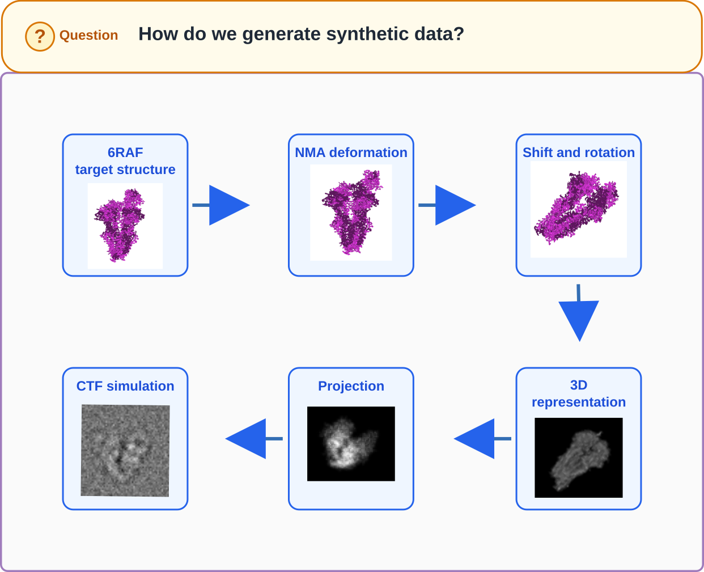
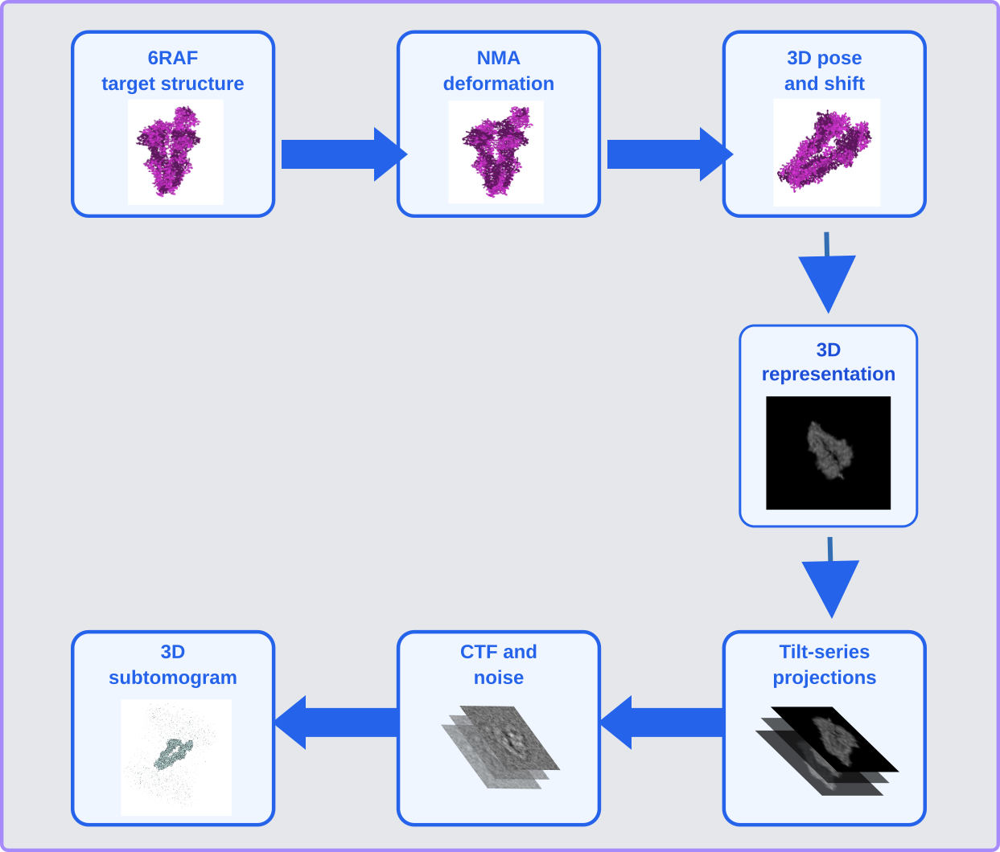
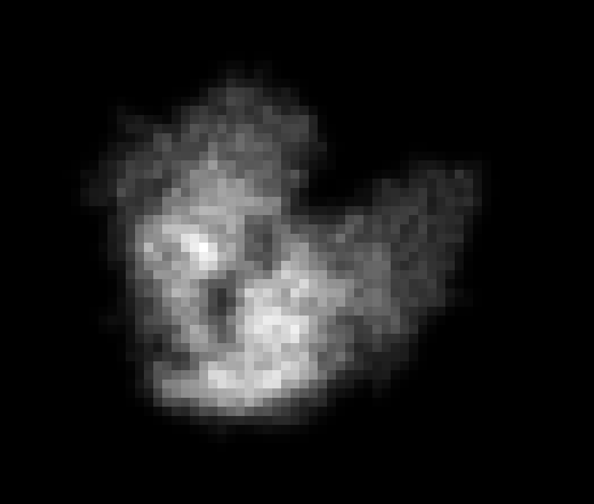

# Generate the synthetic dataset

## Goal

In this section, we will generate a synthetic cryo-EM/ET dataset from the target `6RAF` conformation. This dataset (not the `6RAH` conformation) will later serve as input to the corresponding workflow.

The generated dataset creates a controlled experiment: we know which structures generated the particles and have all the ground-truth information.

---

## Conceptual overview

A synthetic cryo-EM/ET dataset is generated by simulating how a molecular structure would appear as particle images or subtomograms under different orientations and imaging conditions.

The generation process can be summarized as:

=== "Single-particle EM"

    

    /// caption
    Fig. 0. Single-particle EM data generation overview.
    ///

=== "Tomography ET"

    

    /// caption
    Fig. 0. Tomography ET data generation overview.
    ///

---

## Input structure

The starting point for dataset generation is a molecular structure in PDB format.

The PDB file contains the atomic coordinates of the target `6RAF` conformation. These coordinates define the three-dimensional molecular model from which the synthetic dataset will be generated.

---

## Conformational deformation

The target structure is also deformed before projection.

The deformations will be generated using normal mode analysis (NMA)[^1]. Normal modes describe collective motions of the molecular structure. By moving the structure along one or several selected modes, it is possible to generate a controlled conformational variation.

[^1]: [SuhreK.SanejouandY. H. (2004). ELNEMO: a normal mode web server for protein movement analysis and the generation of templates for molecular replacement. Nucleic Acids Res. 32, W610–W614. 10.1093/nar/gkh368](https://pubmed.ncbi.nlm.nih.gov/15215461/)

This allows the synthetic dataset to include not only different viewing directions, but also structural variability.

<video width="800" controls autoplay loop muted playsinline>
  <source src="../assets/modes.webm" type="video/webm">
  <a href="https://mdspace-toolkit.github.io/cryonet-2026-mdspace-practical/assets/modes.webm">
    Open the video in the interactive online version
  </a>
</video>

/// caption
Fig. 1. Structural displacements associated with modes 7 and 8 of `6RAF`.
///

---

=== "Single-particle EM"

    ## Rotations and translations

    Each particle image corresponds to a molecule observed from a particular orientation. To reproduce this, the target structure is randomly rotated before projection. Small translations are also applied to simulate imperfect particle centering.

    ## Projection using an atomic scattering-factor representation

    To generate a 2D image from the atomic structure, the molecule is first converted into a three-dimensional density volume using XMIPP's element-specific atomic scattering profiles [^2]. The volume is then projected onto an image plane along a selected projection direction.

    <video width="800" controls autoplay loop muted playsinline>
      <source src="../assets/3D.webm" type="video/webm">
      <a href="https://mdspace-toolkit.github.io/cryonet-2026-mdspace-practical/assets/3D.webm">Open the video in the interactive online version</a>
    </video>

    /// caption
    Fig. 2. Three-dimensional density generated using element-specific atomic scattering profiles.
    ///

    { width="400" }

    /// caption
    Fig. 3. Two-dimensional projection of the generated density.
    ///

    ## CTF simulation and noise

    Real cryo-EM images are affected by the microscope contrast transfer function (CTF). The CTF modifies the image in Fourier space, introducing characteristic contrast oscillations. Simulating the CTF makes the generated images more realistic.

    Additive noise is then added to approximate the low signal-to-noise ratio typical of cryo-EM particle images.

=== "Tomography ET"

    ## Rotations and translations

    Each subtomogram represents a molecule observed through a tilt series. The target structure is rotated to define its 3D pose, and small translations can be applied to reproduce imperfect centering.

    ## Tilt-series and subtomogram generation

    The atomic structure is converted into a 3D density using XMIPP's element-specific atomic scattering profiles [^2]. Instead of generating a single 2D projection, the volume is projected repeatedly over the selected tilt range. These projections are combined into a synthetic 3D subtomogram.

    For this practical, the tilt range is set from -90° to +90° with a 2° step. This simplified full angular range avoids introducing a missing-wedge effect, so the example focuses on the MD-based flexible fitting step.

    ### CTF simulation and noise

    The CTF is applied to the individual 2D tilt projections before they are assembled into the synthetic subtomogram. Additive noise is then added to reach the selected signal-to-noise ratio.

[^2]: [De la Rosa-Trevín, J. M., et al. "Xmipp 3.0: an improved software suite for image processing in electron microscopy." Journal of Structural Biology 184.2 (2013): 321-328.](https://doi.org/10.1016/j.jsb.2013.08.008)

---

## Generate the dataset in MDSPACE Desktop

<video width="800" controls loop autoplay muted playsinline>
  <source src="../assets/generation.webm" type="video/webm">
  <a href="https://mdspace-toolkit.github.io/cryonet-2026-mdspace-practical/assets/generation.webm">
    Open the video in the interactive online version
  </a>
</video>

/// caption
Fig. 4. Dataset generation using MDSPACE Desktop.
///

Download the input [`6RAF.pdb`](https://files.rcsb.org/download/6RAF.pdb) file, then open the data generation module in MDSPACE using Tools > Data Generator. A new data generator window is created in the interface.

In the Parameter dock, first select a data folder (for example, `generated_dataset`) as the output directory. The other generator fields remain disabled until an output directory has been selected. Select `6RAF.pdb` as the input PDB file.

The following settings are shared by both practical variants:

- Sampling: 2 Å/pixel.
- Size: 128 pixels.
- Resize: 1.
- Modes: 7, 8.
- Parallel threads: leave the default value.
- Sigma shift: 0.
- Sigma angle: 0°.

The sigma parameters are optional metadata-noise controls. Shift noise is specified in pixels and angle noise is isotropic and specified in degrees. Keeping both at zero makes the ground-truth comparison easier.

=== "Single-particle EM"

    Set the output type to `2D particle images`.

    Use 500 images for the practical. The dataset is relatively light and is sufficient to illustrate the recovery workflow.

    Set SNR to 0.2. The CTF is applied to each projection and additive noise is then added according to this SNR.

    If individual ground-truth PDB files are required, select `HDF5 + PDBs` in the ground-truth output option. Otherwise, the HDF5 archive is sufficient for the analysis below.

=== "Tomography ET"

    Set the output type to `3D subtomograms`.

    Use 500 subtomograms. Subtomogram generation is heavier than image generation, but the 3D fitting problem is better constrained for this simplified practical.

    Set the tilt series to:

    - Tilt minimum: -90°.
    - Tilt maximum: +90°.
    - Tilt step: 2°.

    This full angular range deliberately avoids a missing-wedge complication in the practical.

    Set SNR to 0.2. The CTF is applied to each tilt projection, additive noise is then added, and the processed projections are reconstructed into subtomograms.

    If individual ground-truth PDB files are required, select `HDF5 + PDBs` in the ground-truth output option. Otherwise, the HDF5 archive is sufficient for the analysis below.

These values are chosen to balance computational efficiency with scientific value. The EM dataset contains 500 square images of 128 pixels at 2 Å/pixel. The ET dataset contains 500 subtomograms with the same box size and sampling, and uses a complete -90° to +90° tilt range. Both variants use the first two non-trivial normal modes for deformation.

The user can experiment by setting the other parameters as they see fit. The documentation for each parameter is accessible by hovering over the input widgets.

Then start the dataset generation by clicking Start Step.

---

## Expected output

At the end of this step, MDSPACE should produce a synthetic dataset containing:

- An output folder containing particle images or subtomograms, displayed in the UI alongside their metadata.
- Optionally, an output folder containing the PDBs used for the projection when `HDF5 + PDBs` was selected.
- An HDF5 archive containing all ground-truth information.

Before continuing, make sure the generated dataset is visible in the UI and that no errors were reported during generation. If you encounter any errors, check the Logs dock for details and restart the generation step if necessary.
