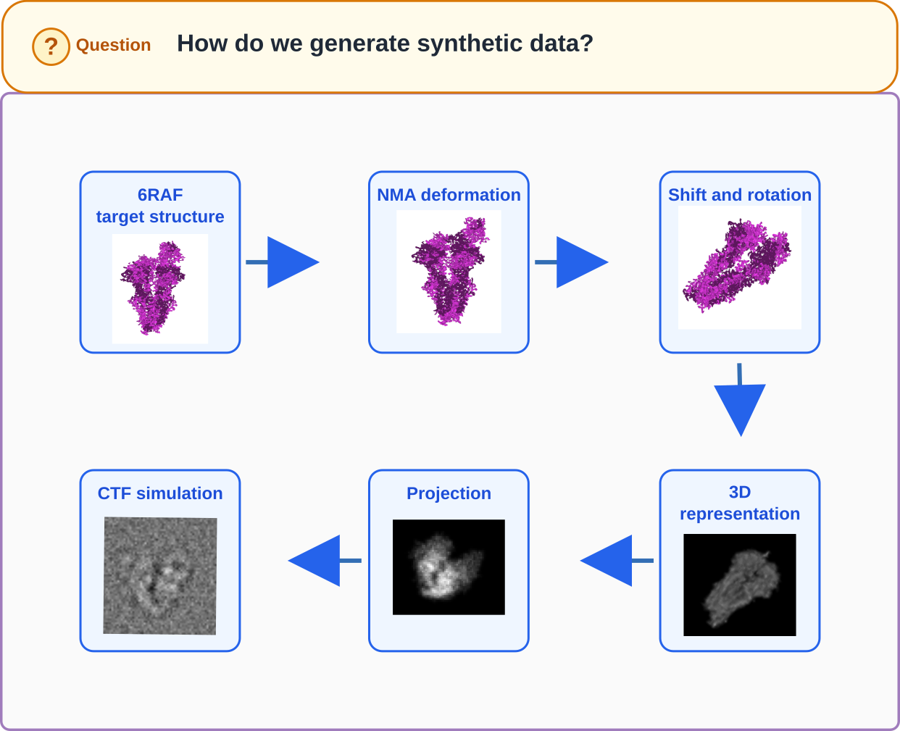
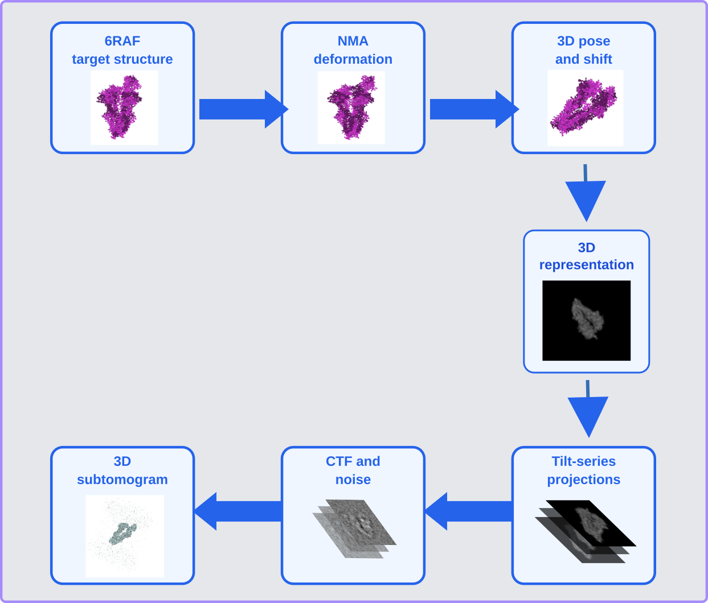
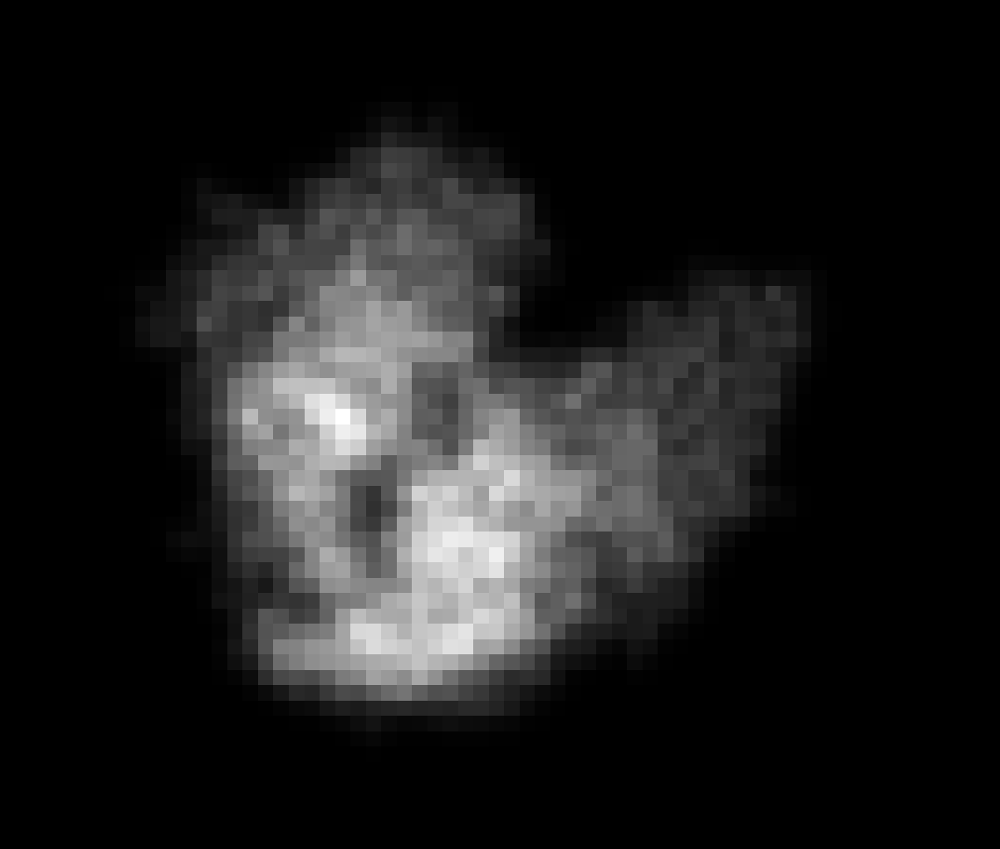

# Generate the synthetic dataset

## Goal

In this section, we will generate a synthetic cryo-EM/ET dataset from the target `6RAF` conformation. This dataset (not the `6RAH` conformation) will later serve as input to the corresponding workflow.

The generated dataset creates a controlled experiment: we know which structures generated the particles and have all the ground-truth information.

---

## Conceptual overview

A synthetic cryo-EM/ET dataset is generated by simulating how a molecular structure would appear as particle images or subtomograms under different orientations and imaging conditions.

The generation process can be summarized as:

=== "Single-particle EM"

    

    /// caption
    Fig. 0. Single-particle EM data generation overview.
    ///

=== "Tomography ET"

    

    /// caption
    Fig. 0. Tomography ET data generation overview.
    ///

---

## Input structure

The starting point for dataset generation is a molecular structure in PDB format.

The PDB file contains the atomic coordinates of the target `6RAF` conformation. These coordinates define the three-dimensional molecular model from which the synthetic dataset will be generated.

---

## Conformational deformation

The target structure is also deformed before projection.

The deformations will be generated using normal mode analysis (NMA)[^1]. Normal modes describe collective motions of the molecular structure. By moving the structure along one or several selected modes, it is possible to generate a controlled conformational variation.

[^1]: [SuhreK.SanejouandY. H. (2004). ELNEMO: a normal mode web server for protein movement analysis and the generation of templates for molecular replacement. Nucleic Acids Res. 32, W610–W614. 10.1093/nar/gkh368](https://pubmed.ncbi.nlm.nih.gov/15215461/)

This allows the synthetic dataset to include not only different viewing directions, but also structural variability.

<video width="800" controls autoplay loop muted playsinline>
  <source src="../assets/modes.webm" type="video/webm">
  <a href="https://mdspace-toolkit.github.io/cryonet-2026-mdspace-practical/assets/modes.webm">
    Open the video in the interactive online version
  </a>
</video>

/// caption
Fig. 1. Structural displacements associated with modes 7 and 8 of `6RAF`.
///

---

=== "Single-particle EM"

    ## Rotations and translations

    Each particle image corresponds to a molecule observed from a particular orientation. To reproduce this, the target structure is randomly rotated before projection. Small translations are also applied to simulate imperfect particle centering.

    ## Projection using an atomic scattering-factor representation

    To generate a 2D image from the atomic structure, the molecule is first converted into a three-dimensional density volume using XMIPP's element-specific atomic scattering profiles [^2]. The volume is then projected onto an image plane along a selected projection direction.

    <video width="800" controls autoplay loop muted playsinline>
      <source src="../assets/3D.webm" type="video/webm">
      <a href="https://mdspace-toolkit.github.io/cryonet-2026-mdspace-practical/assets/3D.webm">Open the video in the interactive online version</a>
    </video>

    /// caption
    Fig. 2. Three-dimensional density generated using element-specific atomic scattering profiles.
    ///

    { width="400" }

    /// caption
    Fig. 3. Two-dimensional projection of the generated density.
    ///

    ## CTF simulation and noise

    Real cryo-EM images are affected by the microscope contrast transfer function (CTF). The CTF modifies the image in Fourier space, introducing characteristic contrast oscillations. Simulating the CTF makes the generated images more realistic.

    Additive noise is then added to approximate the low signal-to-noise ratio typical of cryo-EM particle images.

=== "Tomography ET"

    ## Rotations and translations

    Each subtomogram represents a molecule observed through a tilt series. The target structure is rotated to define its 3D pose, and small translations can be applied to reproduce imperfect centering.

    ## Tilt-series and subtomogram generation

    The atomic structure is converted into a 3D density using XMIPP's element-specific atomic scattering profiles [^2]. Instead of generating a single 2D projection, the volume is projected repeatedly over the selected tilt range. These projections are combined into a synthetic 3D subtomogram.

    For this practical, the tilt range is set from -90° to +90° with a 2° step. This simplified full angular range avoids introducing a missing-wedge effect, so the example focuses on the MD-based flexible fitting step.

    ### CTF simulation and noise

    The CTF is applied to the individual 2D tilt projections before they are assembled into the synthetic subtomogram. Additive noise is then added to reach the selected signal-to-noise ratio.

[^2]: [De la Rosa-Trevín, J. M., et al. "Xmipp 3.0: an improved software suite for image processing in electron microscopy." Journal of Structural Biology 184.2 (2013): 321-328.](https://doi.org/10.1016/j.jsb.2013.08.008)

---

## Generate the dataset in MDSPACE Desktop

<video width="800" controls loop autoplay muted playsinline>
  <source src="../assets/generation.webm" type="video/webm">
  <a href="https://mdspace-toolkit.github.io/cryonet-2026-mdspace-practical/assets/generation.webm">
    Open the video in the interactive online version
  </a>
</video>

/// caption
Fig. 4. Dataset generation using MDSPACE Desktop.
///

Download the input [`6RAF.pdb`](https://files.rcsb.org/download/6RAF.pdb) file, then open the synthetic-dataset simulator in MDSPACE using **Tools > Simulate cryo-EM/cryo-ET data**. A new **Synthetic Cryo-EM/Cryo-ET Dataset Simulator** window is created in the interface. As a shortcut, drag `6RAF.pdb` onto that open simulator window to fill **Reference structure (PDB)**; this does not start generation.

In the **Parameters** dock, open **Analysis folder** and choose **Create synthetic dataset**. In the **Create directory** dialog, select a **Parent folder** (for example, `~/Public`) and enter the **Directory name**. Keep the default directory name, `out`, for this practical. The generated dataset will therefore be stored in `~/Public/out/`; use this folder in the following sections. The other simulator fields remain disabled until an analysis folder has been selected. Select `6RAF.pdb` as the **Reference structure (PDB)**.

The following settings are shared by both practical variants:

- **Pixel size:** 2 Å/pixel.
- **Box size:** 128 pixels.
- **Random seed:** leave `Random`. A fixed positive value can be used to repeat pose, deformation, and CTF sampling, although acquisition noise remains stochastic.
- **Deformation:** `Yes`.
- **NMA method:** `RTB2`.
- **Normal-mode indices:** 7, 8.
- **RTB block size:** 10 residues.
- **Elastic-network cutoff:** 8 Å.
- **Mode relationship:** `Linear`.
- **Deformation amplitude:** `Uniform`, from -100 Å to +100 Å.
- **X shift:** `Uniform`, from -5 to +5 pixels.
- **Y shift:** `Uniform`, from -5 to +5 pixels.
- **Rot angle:** `Uniform`, from 0° to 360°.
- **Tilt angle:** `Uniform`, from 0° to 180°.
- **Psi angle:** `Uniform`, from 0° to 360°.
- **Concurrent simulation tasks:** leave the default value.
- **CTF simulation:** `Yes`.
- **Acceleration voltage:** 300 kV.
- **Spherical aberration:** 2.7 mm.
- **Defocus:** `Constant`, set to -5 000 Å.
- **Astigmatism:** `Constant`, set to 0 Å.
- **Astigmatism angle:** `Constant`, set to 0°.
- **Amplitude contrast (Q₀):** 0.07.
- **Noise simulation:** `Yes`.
- **Phase flip output:** `Yes`. This is the simulator default; it writes phase-flipped images after CTF simulation, matching the uncorrected reconstruction path used below.
- **Metadata noise:** `No`.
- **Ground-truth output:** `HDF5`. This is sufficient for the practical and avoids writing individual PDB files for every generated particle or subtomogram.

The **Metadata noise** switch controls optional errors in the generated shift and angle metadata. Keep it disabled for this controlled recovery experiment. A constant defocus of -5 000 Å prevents particle-to-particle defocus variation. Uniform, normal, and stepped-Gaussian defocus distributions are useful for more realistic simulations but are outside the scope of this practical.

With **Mode relationship** set to `Linear`, one sampled deformation amplitude is applied to both modes 7 and 8. This produces the controlled one-dimensional conformational path used in the later comparison; `Random` would sample the two mode amplitudes independently.

=== "Single-particle EM"

    Set **Dataset type** to `2D particle images`.

    Use 500 images for the practical. The dataset is relatively light and is sufficient to illustrate the recovery workflow.

    Set **Target SNR** to 0.2. The CTF is applied to each projection and additive noise is then added according to this SNR.

    If individual ground-truth PDB files are required, change **Ground-truth output** to `HDF5 + PDBs`. Otherwise, the HDF5 archive is sufficient for the analysis below.

=== "Tomography ET"

    Set **Dataset type** to `3D subtomograms`.

    Use 500 subtomograms. Subtomogram generation is heavier than image generation, but the 3D fitting problem is better constrained for this simplified practical.

    Set the tilt series to:

    - **Minimum tilt:** -90°.
    - **Maximum tilt:** +90°.
    - **Tilt increment:** 2°.
    - **Tilt-series output:** `Discard tilt series`.
    - **Z shift:** `Uniform`, with both bounds set to 0 pixels.

    This full angular range deliberately avoids a missing-wedge complication in the practical.

    Set **Target SNR** to 0.2. The CTF is applied to each tilt projection, additive noise is then added, and the processed projections are reconstructed into subtomograms.

    If individual ground-truth PDB files are required, change **Ground-truth output** to `HDF5 + PDBs`. Otherwise, the HDF5 archive is sufficient for the analysis below. Keeping **Tilt-series output** set to `Discard tilt series` avoids retaining the large set of intermediate tilt images.

These values are chosen to balance computational efficiency with scientific value. The EM dataset contains 500 square images of 128 pixels at 2 Å/pixel. The ET dataset contains 500 subtomograms with the same box size and sampling, and uses a complete -90° to +90° tilt range. Both variants use the first two non-trivial normal modes for deformation.

The user can experiment by setting the other parameters as they see fit. The documentation for each parameter is accessible by hovering over the input widgets.

Start the dataset generation by clicking **Run current stage**.

---

## Expected output

At the end of this step, MDSPACE should produce a synthetic dataset containing:

- An output folder containing particle images or subtomograms, displayed in the UI alongside their metadata.
- Optionally, a `ground_truth_pdb/` folder containing raw and rotated PDB frames when `HDF5 + PDBs` was selected.
- Optionally, a `tilt_series/` folder for the ET variant when **Tilt-series output** was set to `Save tilt series`.
- An HDF5 archive containing all ground-truth information.

Before continuing, make sure the generated dataset is visible in the UI and that no errors were reported during generation. If you encounter an error, check **Activity** in the **Logs** dock for its summary and **Raw Logs** for the generated log files, then restart the generation step if necessary.
