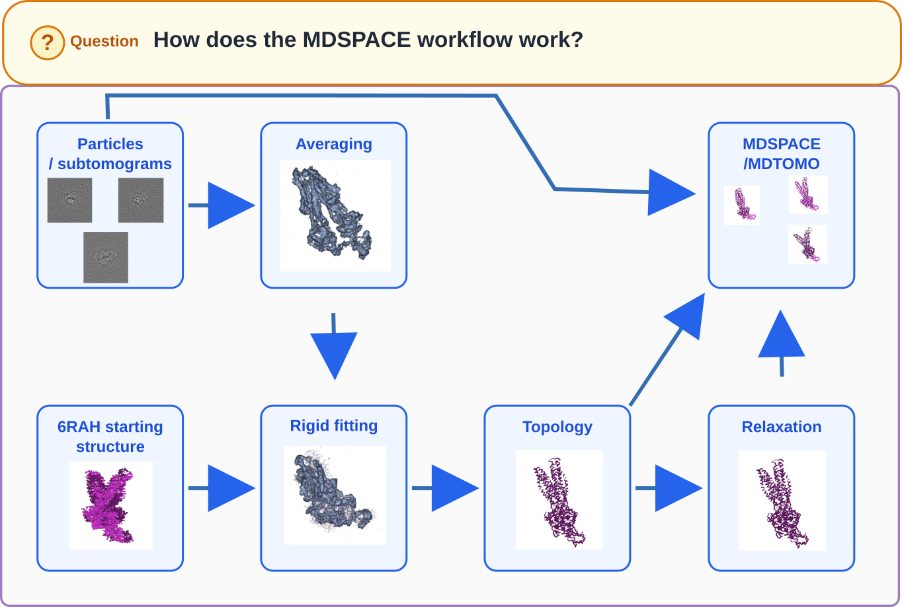
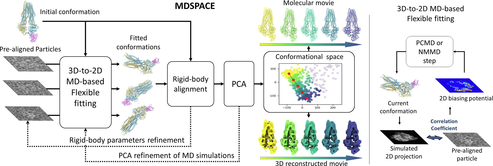

# Run the MDSPACE workflow

In this section, we will prepare the molecular system and run the complete MDSPACE workflow using the synthetic dataset generated in the previous steps.

/// caption
Fig. 0. MDSPACE workflow overview.
///

The goal is to start from another structure, the `6RAH` conformation, which differs from the `6RAF` conformation used to generate the dataset, and to test whether MDSPACE can recover structural deformations using molecular dynamics simulation and information from the cryo-EM images.

The complete workflow contains seven main steps: six preparation steps followed by the MDSPACE analysis.

1. Import the starting structure and image dataset.
2. Reconstruct a 3D volume from the particles.
3. Rigidly register the starting structure into the reconstructed volume.
4. Generate or import the molecular topology.
5. Compute normal modes.
6. Minimize the molecular system.
7. Run the MDSPACE analysis.

<video width="800" height="600" controls autoplay muted loop playsinline>
  <source src="../assets/run.webm" type="video/webm">
  <a href="https://mdspace-toolkit.github.io/cryonet-2026-mdspace-practical/assets/run.webm">
    Open the video in the interactive online version
  </a>
</video>

/// caption
Fig. 1. Complete analysis workflow using MDSPACE Desktop.
///

---

## 0. Create a new workflow

To start a new workflow, use File < New. Workflows can be reloaded using File < Load.

## 1. Import the PDB and XMD files

### Goal

The PDB file provides the molecular structure that will be used as the starting model. The XMD file describes the synthetic cryo-EM particle dataset. It contains the information needed to locate the particle images and read the associated shift and orientation metadata.

### In this practical

We use the `6RAH.pdb` starting conformation as input and the generated `data_stack/particles.xmd` file from the synthetic dataset as the image input.

After creating a new workflow window, import the PDB and XMD files. Check that both inputs are correctly listed in the project and that the particle dataset can be previewed. A successful load should unlock the next step tab in the workflow window.

Because this practical uses single-particle EM images, importing the particle metadata automatically selects `IMAGES` in the MDSPACE `EM Fit Choice` parameter. For ET/tomogram metadata, the interface selects `VOLUMES` instead. The choice should therefore not need to be changed manually for this practical.

---

## 2. Reconstruct a volume from the XMD dataset

### Goal

This step reconstructs a 3D density volume from the synthetic particle images. The reconstructed volume gives a first 3D representation of the image dataset.

This volume is primarily used to align the initial molecular structure with the particle dataset frame of reference.

### In this practical

We reconstruct a volume from the synthetic dataset. The volume must be reconstructed in the same unit as the PDB structure (Ångströms). Enter the pixel size used during dataset generation (2 Å/pixel), then click Start Step.

After reconstruction, visually inspect the volume. The purpose of this step is to obtain a reasonable density for rigid registration, not a perfect high-resolution reconstruction.

---

## 3. Rigidly register the PDB onto the reconstructed volume

### Goal

The goal is to place the starting PDB structure in the same frame of reference as the dataset. This step applies only a global rotation and translation to the molecular structure.

Rigid registration does not change the internal conformation of the PDB structure. It does not bend, deform, or relax the molecule. It only changes its position and orientation.

### In this practical

We register the structure onto the reconstructed density. This gives MDSPACE a properly positioned initial model before molecular dynamics and image fitting begin.

Use the left mouse button to approximately align the structure and the volume. If the reconstruction was performed correctly, the two should match in scale. When the two are roughly aligned, click Start Step to perform the fine automatic registration.

---

## 4. Generate or import the topology

### Goal

The topology describes the molecular system in a format that the molecular dynamics engine can use. It defines the atoms, atom types, bonds, angles, and force-field parameters needed to compute molecular forces.

Without a valid topology, the molecular dynamics part of MDSPACE cannot run.

### In this practical

We will use a coarse-grained C-alpha Go model to generate the structure and the corresponding topology file. In this representation, the system is simplified relative to an all-atom model, greatly reducing the computational cost of molecular dynamics simulations.

This simplification is important for MDSPACE because the workflow performs many short MD simulations, one simulation per particle image and per MDSPACE iteration. A C-alpha Go model makes the practical feasible within a reasonable time while still allowing the recovery of meaningful large-scale conformational changes.

Select CAGO as the force field, then click Start Step. The topology will be computed using the external dependency Smog2[^1].

[^1]: [Noel, Jeffrey K., et al. "SMOG 2: a versatile software package for generating structure-based models." PLoS Computational Biology 12.3 (2016): e1004794.](https://journals.plos.org/ploscompbiol/article?id=10.1371/journal.pcbi.1004794)

---

## 5. Compute normal modes

### Goal

Normal modes can be used in the NMMD part of the MDSPACE workflow. In NMMD, normal-mode directions are combined with MD-based atomic displacements to encourage collective motions and accelerate large-scale conformational changes.

### In this practical

Because the synthetic dataset was itself generated using normal modes, **we do not use the computed normal modes during the recovery workflow**. However, normal modes can still be computed using the external dependency ELNEMO[^2] and visualized for inspection by clicking Start Step.

[^2]: [Suhre, K., and Sanejouand, Y. H. (2004). ELNEMO: a normal mode web server for protein movement analysis and the generation of templates for molecular replacement. Nucleic Acids Research 32, W610–W614.](https://pubmed.ncbi.nlm.nih.gov/15215461/)

---

## 6. Minimize the system

### Goal

The input structure may contain local strain, unfavorable contacts, or small inconsistencies from the original PDB file. Minimization relaxes the structure before the MDSPACE run.

This step prepares a stable molecular system for the later simulation.

### In this practical

We minimize the registered C-alpha `6RAH` structure. After minimization, the structure should remain close to the registered input model while improving its local geometry.

A small structural adjustment is expected. A large, unexpected displacement may indicate a problem with the input structure, topology, or minimization settings.

---

## Principle of the MDSPACE method

MDSPACE, for **M**olecular **D**ynamics simulation for **S**ingle **P**article **A**nalysis of **C**ontinuous **C**onformational h**E**terogeneity, is an iterative method designed to extract continuous conformational landscapes from cryo-EM single-particle images.

For each particle image, MDSPACE starts from the same initial atomic structure and performs 3D-to-2D flexible fitting. During this fitting, the molecular dynamics simulation is guided by a 2D image-based biasing potential, which compares the experimental particle image with a simulated projection of the current atomic model.

After each MDSPACE iteration, the fitted structures obtained from the particle images form an ensemble of conformations. This ensemble is rigidly aligned and analyzed by principal component analysis. The dominant principal component directions are then used to guide the next round of MD-based fitting. This makes the fitting more robust, especially for particle views where the conformational change is weak, ambiguous, or difficult to observe in projection.

MDSPACE also refines the initial rigid-body alignment of the particles over the iterations. Therefore, the workflow progressively improves both the molecular conformations and the particle orientation and translation parameters.

/// caption
Fig. 2. Flowchart of the MDSPACE method reproduced from [^3].
///

[^3]: [Vuillemot, Rémi, et al. "MDSPACE: Extracting continuous conformational landscapes from cryo-EM single particle datasets using 3D-to-2D flexible fitting based on Molecular Dynamics simulation." Journal of Molecular Biology 435.9 (2023): 167951.](https://www.sciencedirect.com/science/article/pii/S0022283623000074)

---

## 7. Run the MDSPACE analysis

### Goal

In MDSPACE, 3D-to-2D flexible fitting uses a biasing potential based on the correlation coefficient between the experimental particle image and a 2D projection simulated from the atomic model. This image-projection agreement guides the MD simulation.

The result is an ensemble of fitted structures, one per particle image, together with refined metadata.

### In this practical

We run MDSPACE starting from the registered and minimized `6RAH` C-alpha structure.

We use four MDSPACE iterations. The first iteration uses standard MD-based 3D-to-2D flexible fitting **without normal modes. This avoids injecting the normal-mode information that was used to generate the synthetic dataset directly into the recovery process**.

After the first iteration, MDSPACE analyzes the ensemble of fitted structures using principal component analysis. The following iterations use PCA-based refinement with 3 components. In these iterations, the principal component vectors from the previous ensemble are used to guide MD-based flexible fitting in the next iteration using NMMD. For this, select the MD THEN NMMD option.

The full list of parameters can mostly be left at their default values except for the following:

- Iterations: 4.
- Number of Steps: 10 000.
- Time Step: 0.0035 ps.
- Simulation Type: MD_THEN_NMMD.
- Restraint Constant K: 3 500 kcal/mol.

This iterative process incorporates ensemble conformational information into the MD simulation, making the 3D-to-2D fitting of individual particle images more robust to noise and to views where conformational changes are less detectable or ambiguous in the projection plane.

### While MDSPACE is running

The run may take several minutes, depending on the selected settings and available computing resources. During this time, we will continue the analysis using the workflow already computed, which is provided in the practical data folder.
