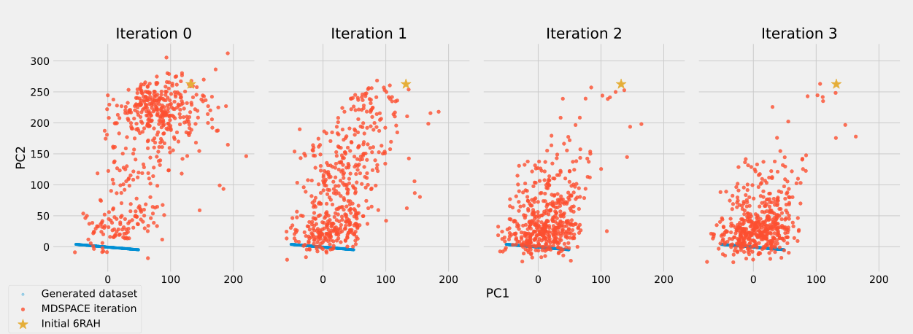
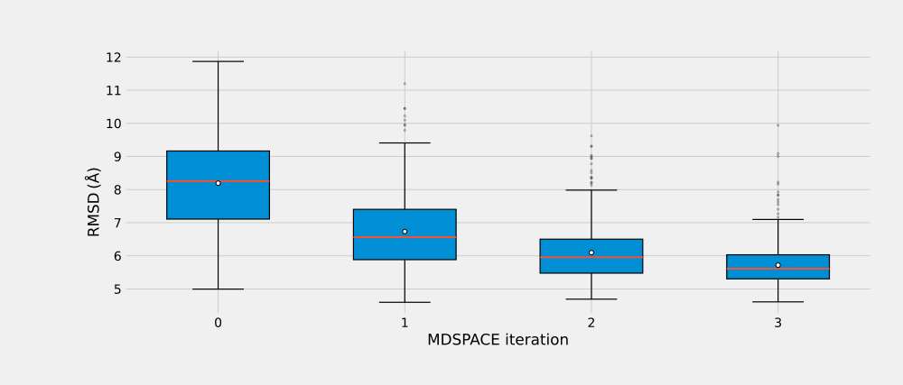

# Post-processing and visualization

In this section, we will inspect the results produced by the MDSPACE workflow and compare them with the known structures from the synthetic experiment.

We will start with a quick inspection inside the MDSPACE Desktop, then move to a Python analysis using the `mdspace-analysis` library. The Python part will allow us to load the generated conformations and the structures produced at each MDSPACE iteration, with more flexibility than in MDSPACE Desktop. `mdspace-analysis` is kept in synch with the MDSPACE C++ library and MDSPACE Desktop and should be installed and used using the same major version used to produce the data.

The goal is to check whether the conformations recovered by MDSPACE progressively move toward the synthetic conformational space used to generate the particle images.

---

## Quick inspection in MDSPACE

<video width="800" height="600" controls muted loop autoplay>
  <source src="../assets/mdspace_inspect.webm" type="video/webm">
</video>

/// caption
Fig. 7. Inspection of the workflow results using MDSPACE Desktop.
///

Once the MDSPACE run has completed, first inspect the results directly in the software. If the provided machines are too slow to run the analysis in a reasonable time, it is time to load the completed MDSPACE analysis provided in the practical data folder.

Open the General tab and check that the MD jobs finished correctly. MDSPACE Desktop can display all molecular dynamics simulation outputs, averaged across all simulations, including the image correlation coefficient (RESTR_CVS001) and other useful quantities.

MDSPACE Desktop can display quick PCA and UMAP projections of the recovered structures. At this stage, these plots are mainly used as diagnostic views: they help check whether the results look reasonable, whether some structures behave as outliers, and whether the analysis parameters are appropriate. In the Explorator tab, clicking on the map can select a structure and display the deformation during the simulation, the associated image, and the data for this given simulation. Selecting several points can reconstruct a volume and see the averaged MD simulation data.

This software-based inspection is useful for a first look, but we will continue the analysis in Python to compare the recovered structures with the synthetic ground truth.

---

## Python analysis

We will now use the `mdspace-analysis` Python package to inspect the HDF5 files produced by MDSPACE.

The analysis will use two sources of structures:

- The synthetic conformations stored in `generated_data.h5`;
- The registered structures stored in each MDSPACE iteration folder, for example, `genesis/000/coords.h5`, `genesis/001/coords.h5`, and so on.

The synthetic structures correspond to the conformations used to generate the particle images. They are deformed structures before projection, rotation, and image shifts. The MDSPACE structures will be loaded from the registered frames, as these have already been placed in a common coordinate frame (the image one) that matches the synthetic structure.

Because the `6RAF` and `6RAH` can have different atom orderings and atom counts, we will first compute a paired C-alpha selection between the two archives. This ensures that all structures are compared using the same atoms in the same order.

We will then project all structures into the same PCA space. We will also compute RMSD-based summaries to compare the recovered structures with the generated synthetic conformations.

---

## Install the analysis tools

Install the plotting dependencies and the `mdspace-analysis` package:

```bash
python -m venv venv
source venv/bin/activate

pip install scikit-learn matplotlib
pip install https://github.com/MDSPACE-toolkit/mdspace-analysis/releases/download/v0.1.0/mdspace_analysis-0.1.0-py3-none-any.whl
```

Then import the required modules:

```python
from pathlib import Path
import numpy as np
import matplotlib.pyplot as plt
from sklearn.decomposition import PCA
from mdspace_analysis import MdspaceHdf5
from mdspace_analysis.geometry import align_coordinates, rmsd
```

---

## Set the input paths

Set the path to the generated synthetic dataset and to the MDSPACE project folder:

```python
# Path to the generated synthetic dataset.
generated_h5 = Path("/home/guest/Public/out/generated_data.h5")

# Path to the MDSPACE project directory.
project_dir = Path("/home/guest/Public/0eaf7db35391a5d2/")
```

Adapt these paths to match the folder names used during the practical.

Then define the HDF5 archive produced at each MDSPACE iteration:

```python
iteration_archives = [
    project_dir / "genesis" / f"{iteration:03d}" / "coords.h5"
    for iteration in range(4)
]
```

---

## Compute the common C-alpha selection

Before comparing the generated structures with the MDSPACE structures, we need to make sure that both datasets use **the same atoms in the same order**.

This step is important because the generated structure and the MDSPACE structure may not use exactly the same residue numbering. For example, one PDB may keep the original residue numbers, while another one may have been renumbered during preprocessing. In addition, the generated dataset files contain full atoms, whereas the MDSPACE outputs contain only carbon alpha atoms.

We therefore compute a paired C-alpha selection between the generated archive and the first MDSPACE archive (this is possible because we store the original complete PDB in the archive in addition to each coordinate as matrices):

```python
with MdspaceHdf5(generated_h5) as generated_archive, MdspaceHdf5(iteration_archives[0]) as mdspace_archive:
    common_selection = generated_archive.selection_from_archive(
        mdspace_archive,
        selection="ca",
    )

print("Common C-alpha atoms:", common_selection.size)
```

The resulting selection contains the C-alpha atoms that are present in both archives and can be safely compared.

---

## Load the synthetically generated conformations

The generated dataset contains an HDF5 file named `generated_data.h5`.

This file stores the coordinate-level ground truth of the synthetic dataset. For the PCA comparison, we use the raw generated conformations because they represent the synthetic structures before projection, rotation, and image shifts, but with deformations.

```python
with MdspaceHdf5(generated_h5) as archive:
    generated_structures = [
        archive.raw(frame, selection=common_selection.left)
        for frame in range(archive.n_frames)
    ]

generated_structures = np.asarray(generated_structures)

print("Generated structures:", generated_structures.shape[0])

print("Common C-alpha atoms:", generated_structures.shape[1])
```

---

## Load the MDSPACE iterations

Each MDSPACE iteration writes an HDF5 archive in its corresponding genesis sub-folder.

For example, if four iterations were run, the project may contain:

```bash
genesis/000/coords.h5

genesis/001/coords.h5

genesis/002/coords.h5

genesis/003/coords.h5
```

We load the registered C-alpha structures from each iteration:

```python
mdspace_iterations = []
for h5_path in iteration_archives:
    with MdspaceHdf5(h5_path) as archive:
        frames_by_image = {}
        for frame in range(archive.n_frames):
            image = archive.image_index(frame)
            structure = archive.registered(
                frame,
                selection=common_selection.right,
            )
            frames_by_image[image] = structure
        mdspace_iterations.append(frames_by_image)

for iteration, frames in enumerate(mdspace_iterations):
    print(f"Iteration {iteration}: {len(frames)} structures")
```

The registered frames are used because they have already been aligned and share the same frame of reference as the generated data structures, making them appropriate for PCA.

Using `image_index(frame)` to return a dictionary `{image index, structure}` is safer than assuming that frame 0 always corresponds to image 0, because some images may be skipped or dropped during processing if MD simulations fail.

---

## Build one common PCA space

To visually compare all structures, we project them onto a common PCA space.

Here, the PCA space is computed using both:

1. The generated ground-truth conformations.
2. The initial `6RAH` structure used to start the MDSPACE workflow.

The MDSPACE structures recovered at each iteration are then projected onto this same PCA basis.

This choice makes the interpretation more informative. The generated conformations define the target conformational trajectory, while the initial `6RAH` structure helps define the direction separating the starting structure from this target trajectory. As a result, the PCA space can show both the generated conformational variability and the displacement of the initial structure away from the generated conformational region.

All subplots are then displayed in the same PC1/PC2 coordinate system, allowing direct comparison between MDSPACE iterations.

```python
with MdspaceHdf5(iteration_archives[0]) as archive:
    initial_structure = archive.reference_coordinates(
        selection=common_selection.right,
    )
```

Now build the PCA reference space:

```python
pca_reference_structures = list(generated_structures)
pca_reference_structures.append(initial_structure)

pca_reference_X = np.asarray([
    structure.reshape(-1)
    for structure in pca_reference_structures
])

print("PCA reference input matrix:", pca_reference_X.shape)

pca = PCA(n_components=2)
pca_reference_projection = pca.fit_transform(pca_reference_X)

generated_projection = pca_reference_projection[:len(generated_structures)]
initial_projection = pca_reference_projection[
    len(generated_structures)
].reshape(1, -1)

print("Reference PCA explained variance:", pca.explained_variance_ratio_)
print("Initial `6RAH` projection:", initial_projection)
```

Now project each MDSPACE iteration into this same PCA space:

```python
mdspace_projections = []

for iteration, frames in enumerate(mdspace_iterations):
    iteration_X = np.asarray([
        structure.reshape(-1)
        for _, structure in sorted(frames.items())
    ])

    iteration_projection = pca.transform(iteration_X)
    mdspace_projections.append(iteration_projection)

    print(
        f"Iteration {iteration} projected matrix:",
        iteration_X.shape,
    )
```

---

## Plot the MDSPACE iterations

We can now plot each MDSPACE iteration in the same PCA space.

Each subplot shows the generated ground-truth conformations, the initial `6RAH` structure, and one MDSPACE iteration.

```python
fig, axes = plt.subplots(
    1,
    len(mdspace_projections),
    figsize=(4 * len(mdspace_projections), 4),
    sharex=True,
    sharey=True,
)

if len(mdspace_projections) == 1:
    axes = [axes]

for iteration, ax in enumerate(axes):
    iteration_projection = mdspace_projections[iteration]

    ax.scatter(
        generated_projection[:, 0],
        generated_projection[:, 1],
        s=12,
        alpha=0.35,
        label="Generated dataset",
    )

    ax.scatter(
        iteration_projection[:, 0],
        iteration_projection[:, 1],
        s=22,
        alpha=0.8,
        label="MDSPACE iteration",
    )

    ax.scatter(
        initial_projection[0, 0],
        initial_projection[0, 1],
        s=90,
        marker="*",
        label="Initial `6RAH`",
    )

    ax.set_title(f"Iteration {iteration}")
    ax.set_xlabel("PC1")

axes[0].set_ylabel("PC2")
axes[0].legend()

plt.tight_layout()
plt.show()
```

The important point is that all four subplots use the same PCA axes. Therefore, the movement of the MDSPACE clouds can be interpreted as an evolution within one shared structural space. In this representation, the generated conformations define the target trajectory, while the initial `6RAH` marker indicates where the workflow started before flexible fitting.

---

## RMSD analysis

The PCA plot gives a visual summary of the conformational recovery. We can complement it with a coordinate-based measurement using RMSD.

A strict per-image RMSD compares each recovered structure to the generated conformation associated with the same image index. This is useful if the goal is to check one-to-one particle-level recovery.

---

## Plot per-image RMSD by iteration

In this dataset, the generated archive is guaranteed to contain all synthetic frames. Therefore, the generated frame index can be used directly as the image index.

The MDSPACE archives may contain only a subset of recovered structures. Therefore, for each MDSPACE archive, we use `frame_by_image_index()` to map `image index -> MDSPACE frame index`.

Then we only compare recovered structures whose image indices are present in both archives.

```python
rmsd_by_iteration = []
n_matched_by_iteration = []
with MdspaceHdf5(generated_h5) as generated_archive:
    n_generated_frames = generated_archive.n_frames
    for iteration, h5_path in enumerate(iteration_archives):
        rmsd_values = []
        with MdspaceHdf5(h5_path) as mdspace_archive:
            mdspace_frame_by_image = mdspace_archive.frame_by_image_index()
            common_images = sorted(
                image
                for image in mdspace_frame_by_image
                if 0 <= image < n_generated_frames
            )

            print(
                f"Iteration {iteration}: "
                f"{len(common_images)} matched images"
            )

            for image in common_images:
                mdspace_frame = mdspace_frame_by_image[image]
                target = generated_archive.raw(
                    image,
                    selection=common_selection.left,
                )

                structure = mdspace_archive.registered(
                    mdspace_frame,
                    selection=common_selection.right,
                )

                aligned_structure = align_coordinates(structure, target)
                value = rmsd(aligned_structure, target)
                rmsd_values.append(value)

        rmsd_values = np.asarray(rmsd_values, dtype=float)
        rmsd_by_iteration.append(rmsd_values)
        n_matched_by_iteration.append(rmsd_values.size)
        if rmsd_values.size == 0:
            print(f"Iteration {iteration}: no matched structures")
            continue

        print(
            f"Iteration {iteration}: "
            f"median RMSD = {np.median(rmsd_values):.3f} Å, "
            f"mean RMSD = {rmsd_values.mean():.3f} Å, "
            f"std = {rmsd_values.std():.3f} Å"
        )

iterations = np.arange(len(rmsd_by_iteration))
valid_positions = []
valid_rmsd_values = []
for iteration, values in enumerate(rmsd_by_iteration):
    if values.size == 0:
        continue
    valid_positions.append(iteration)
    valid_rmsd_values.append(values)

plt.figure(figsize=(6, 4))
plt.boxplot(
    valid_rmsd_values,
    positions=valid_positions,
    widths=0.6,
    showmeans=True,
)

plt.xlabel("MDSPACE iteration")
plt.ylabel("RMSD to matching generated structure (Å)")
plt.title("Per-image recovery error across MDSPACE iterations")
plt.xticks(iterations)
plt.tight_layout()
plt.show()
```

---

## Interpretation of the results

The PCA projection in Figure 8 shows the evolution of the structures recovered by MDSPACE across iterations. The PCA space is computed using only the generated ground-truth conformations together with the initial `6RAH` structure. The structures recovered at each MDSPACE iteration are then projected into this common PCA space.

{ width="800" height="600" }

/// caption
Fig. 8. Evolution of the principal-component space across MDSPACE iterations. The analysis was performed using 10,000 steps with a time step of 0.0035 ns and a restraint constant, (K) of 3,500 kcal/mol.
///

At iteration 0, the MDSPACE structures are still widely distributed, indicating that the ensemble recovered during the first iteration contains substantial structural variability relative to the generated ground-truth trajectory. Across subsequent iterations, the MDSPACE cloud progressively moves closer to the generated conformational region and becomes more compact. This indicates that the iterative fitting procedure reduces the discrepancy between the starting model and the synthetic dataset.

To quantify this trend, we computed the RMSD between each MDSPACE-recovered structure and its corresponding ground-truth conformation as shown in Figure 9.

{ width="800" }

/// caption
Fig. 9. Distribution of the per-image RMSD between each MDSPACE-recovered structure and its corresponding generated ground-truth conformation across MDSPACE iterations.
///

The RMSD distribution confirms the visual trend observed in the PCA projection. The median RMSD decreases sharply from iteration 0 to iteration 1 and continues to improve thereafter.

> Note that the parameters used in this analysis are a trade-off between computing time and results, and that better fitting can be achieved using longer simulations (number of steps and time step parameters) and a better image fitting (EM fit parameters).

Overall, these results show that MDSPACE recovers part of the conformational variability present in the generated dataset. The recovery is not exact, and the fitted structures remain more dispersed than the ground-truth conformations, but the global trend is clear: the ensemble moves toward the generated conformational space, and the per-image structural error decreases over the first iterations.
