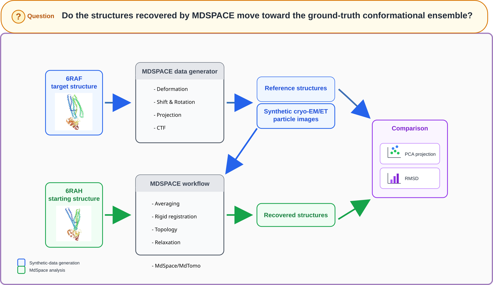

# Overview

Welcome to the MDSPACE practical session for the CryoNET Advanced Image Processing Workshop 2026.

In this practical, we will use the MDSPACE Desktop to explore how cryo-EM image analysis and molecular dynamics simulation can be combined to study conformational variability.

The session is built around a controlled TmrAB (simplified) recovery experiment. Select the variant corresponding to the data type being analyzed:

=== "Single-particle EM"

    This practical uses MDSPACE to analyze single-particle cryo-EM images through 3D-to-2D flexible fitting based on molecular dynamics simulations. See [Vuillemot et al., *MDSPACE*, Journal of Molecular Biology 435, 167951 (2023)](https://doi.org/10.1016/j.jmb.2023.167951).

    We will first generate a synthetic dataset of 2D cryo-EM particle images from a known `6RAF` TmrAB conformation using normal modes analysis. We will then initialize MDSPACE from the different `6RAH` conformation and test whether the workflow recovers the conformations that generated the images.

=== "Tomography ET"

    This practical uses MDTOMO to analyze cryo-ET subtomograms through 3D flexible fitting based on molecular dynamics simulations. See [Vuillemot, Rouiller & Jonić, *MDTOMO*, Scientific Reports 13, 10596 (2023)](https://doi.org/10.1038/s41598-023-37037-9).

    We will first generate a synthetic dataset of 3D cryo-ET subtomograms from a known `6RAF` TmrAB conformation using normal modes analysis. We will then initialize the tomography workflow from the different `6RAH` conformation and test whether it recovers the conformations that generated the subtomograms.

---

## Practical objective

The objective of this session is to understand the complete MDSPACE workflow, from structure-based data generation to conformational recovery and interpretation.

/// caption
Fig. 1. Practical overview.
///

By the end of the practical, you should understand:

- How to create and configure an MDSPACE project.
- How a synthetic cryo-EM/ET dataset can be generated from a molecular structure inside MDSPACE Desktop.
- How MDSPACE combines image analysis and molecular dynamics to explore conformational change.
- How to inspect intermediate and final results.

---

## Prerequisites

The practical will be performed using MDSPACE Desktop, and the data analysis will be performed using Python and the mdspace-analysis library.

Before starting, participants should be comfortable with:

- Basic concepts of single-particle cryo-EM.
- Molecular structures in PDB format.
- The idea of conformational variability.
- Navigating files, folders, and a graphical scientific software interface.
- Basic Python programming.

---

## Software and data

The practical will use the following material:

- MDSPACE Desktop and its external dependencies that should already be installed.
- `6RAF` a TmrAB target conformation used to generate the synthetic cryo-EM/ET dataset.
- `6RAH` a TmrAB starting conformation used to initialize the MDSPACE analysis.

The practical uses two TmrAB conformations with distinct roles:

| Structure | Used for dataset generation | Used as initial MDSPACE model | Used for final analysis |
| --------- | --------------------------- | ----------------------------- | ----------------------- |
| `6RAF`      | Yes                         | No                            | Yes                     |
| `6RAH`      | No                          | Yes                           | Yes                     |

---

## Practical plan

The practical is organized as a guided 2 h 30 session, during which every participant should be able to perform all the steps.

| Time      | Step                               | Goal                                                  |
| --------- | ---------------------------------- | ----------------------------------------------------- |
| 0:00–0:10 | Introduction and environment check | Open MDSPACE and verify access to the data            |
| 0:10–0:40 | Generate the synthetic dataset     | Create cryo-EM data from the target structure         |
| 0:40–1:00 | Inspect the generated dataset      | Check images, metadata, and expected outputs          |
| 1:00–2:00 | Run the MDSPACE workflow           | Process the dataset and launch the analysis           |
| 2:00–2:25 | Post-processing and visualization  | Inspect recovered structures and conformational space |
| 2:25–2:30 | Wrap-up                            | Discuss interpretation, limitations, and next steps   |

---
